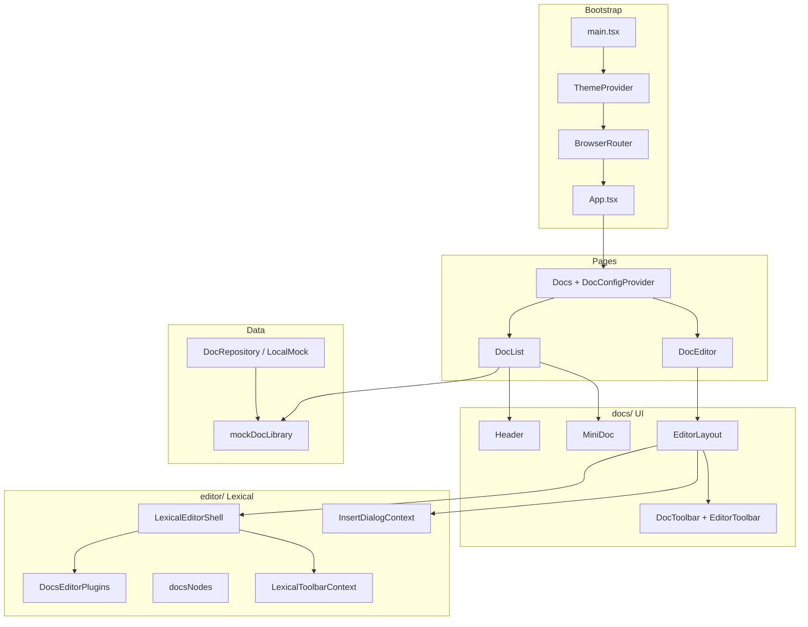

# One World Docs — Project Documentation

A standalone React document editor and library UI, built as part of the **One World** ecosystem. Users browse a mock document library, open documents in a Lexical-based rich-text editor, and use Google Docs–style layout (toolbar, page canvas, optional table of contents and comments).

---

## Table of Contents

1. [Overview](#overview)
2. [Tech Stack](#tech-stack)
3. [Scripts & Development](#scripts--development)
4. [High-Level Architecture](#high-level-architecture)
5. [File Structure](#file-structure)
6. [Layer Segregation](#layer-segregation)
7. [Routing & Navigation](#routing--navigation)
8. [Application Bootstrap](#application-bootstrap)
9. [Pages](#pages)
10. [Docs UI Layer](#docs-ui-layer)
11. [Editor Layer (Lexical)](#editor-layer-lexical)
12. [Data & Repository](#data--repository)
13. [Theme & Styling](#theme--styling)
14. [Shared Components](#shared-components)
15. [Domain Types](#domain-types)
16. [Generators & Scripts](#generators--scripts)
17. [Component Interaction Flow](#component-interaction-flow)
18. [Known Gaps & Future Work](#known-gaps--future-work)

---

## Overview

| Property | Value |
|----------|--------|
| Package name | `one-world-docs` |
| Version | `0.1.0` |
| Dev server | `http://localhost:4900` (Vite, `--strictPort`) |
| Entry | `index.html` → `src/main.tsx` |

The app is intentionally split into **concerns**:

- **Pages** — route-level shells only
- **`docs/`** — product UI (library cards, editor chrome, toolbars, settings)
- **`editor/`** — Lexical composer, nodes, plugins, toolbar logic (reusable editor kernel)
- **`repository/`** — persistence abstraction (mock today, API later)
- **`types/`** — shared TypeScript models (many inherited from the broader One World platform)
- **`shared/`** — cross-feature UI primitives (avatars, loaders, menus)
- **`theme/`** — MUI theme configuration

---

## Tech Stack

| Category | Libraries |
|----------|-----------|
| UI framework | React 19 |
| Build | Vite 6 + `@vitejs/plugin-react-swc` |
| Routing | `react-router` 7 |
| UI kit | MUI 7 (`@mui/material`, `@mui/icons-material`) |
| Styling | Emotion (via MUI), custom CSS for editor |
| Rich text | Lexical 0.31 (`lexical`, `@lexical/react`, table, list, markdown, etc.) |
| Markdown preview | `react-markdown` (document cards in library) |
| Mock data | `@faker-js/faker`, `@multiavatar/multiavatar` |
| Font | Montserrat (`@fontsource/montserrat`) |

---

## Scripts & Development

```bash
npm run dev      # Vite dev server on port 4900
npm run build    # tsc -b && vite build
npm run preview  # Preview production build on 4900
npm run lint     # ESLint
```

Requires **Node.js ≥ 20**.

---

## High-Level Architecture



---

## File Structure

```
one-world-docs/
├── index.html                 # App shell, favicon, root mount
├── vite.config.ts             # Vite + React SWC, port 4900
├── package.json
├── tsconfig.app.json          # Strict TS; excludes some playground files
├── public/
│   └── images/                # e.g. planet-earth.png (branding)
├── dist/                      # Production build output
└── src/
    ├── main.tsx               # React root, MUI theme, router
    ├── App.tsx                # Route definitions
    ├── index.css              # Global styles
    ├── vite-env.d.ts
    │
    ├── pages/                 # Route-level components only
    │   └── docs/
    │       ├── Docs.tsx       # Layout route + DocConfigProvider
    │       ├── DocList.tsx    # Document library grid/list
    │       └── DocEditor.tsx  # Editor route wrapper
    │
    ├── docs/                  # Docs product UI (not Lexical internals)
    │   ├── context/
    │   │   └── DocsConfigContext.tsx
    │   └── components/
    │       ├── Header.tsx
    │       ├── MiniDoc.tsx
    │       ├── DocToolbar.tsx
    │       ├── EditorToolbar.tsx
    │       ├── EditorLayout.tsx
    │       ├── PageLayout.tsx
    │       ├── TableOfContents.tsx
    │       ├── DocComment.tsx
    │       ├── DocCommentsContainer.tsx
    │       ├── DocSettingsMenu.tsx
    │       └── Toolbar/       # Editor toolbar sub-widgets
    │           ├── InsertNodeMenu.tsx
    │           ├── TextStylesMenu.tsx
    │           ├── FontFamilyMenu.tsx
    │           ├── FontSizer.tsx
    │           ├── FontAligner.tsx
    │           ├── TextTransformer.tsx
    │           └── ZoomControllerMenu.tsx
    │
    ├── editor/                # Lexical editor kernel
    │   ├── LexicalEditorShell.tsx
    │   ├── lexicalConfig.ts
    │   ├── docsNodes.ts
    │   ├── editor.css
    │   ├── context/
    │   │   ├── LexicalToolbarContext.tsx
    │   │   └── InsertDialogContext.tsx
    │   ├── hooks/
    │   │   └── useLexicalToolbar.ts
    │   ├── toolbar/
    │   │   └── formatUtils.ts
    │   ├── theme/
    │   │   └── editorTheme.ts
    │   ├── ui/
    │   │   └── ContentEditable.tsx
    │   ├── nodes/
    │   │   └── SimpleImageNode.tsx
    │   ├── plugins/
    │   │   ├── DocsEditorPlugins.tsx
    │   │   └── SimpleImagePlugin.tsx
    │   └── playground/      # Lexical playground-derived nodes/plugins
    │       ├── nodes/         # Poll, YouTube, PageBreak, Layout, etc.
    │       ├── plugins/
    │       └── ui/
    │
    ├── repository/
    │   ├── DocRepository.ts
    │   └── LocalMockDocRepository.ts
    │
    ├── data/
    │   └── mockDocs.ts
    │
    ├── generators/
    │   └── generateMockDoc.ts
    │
    ├── scripts/               # Mock user/post generators for types
    │   ├── GenerateUser.script.ts
    │   ├── MockUserData.script.ts
    │   └── GeneratePost.script.ts
    │
    ├── shared/                # Reusable UI across features
    │   ├── UserAvatar.tsx
    │   ├── UserGroup.tsx
    │   ├── ButtonMenu.tsx
    │   ├── PageLoader.tsx
    │   ├── ComponentLoader.tsx
    │   ├── SearchUser.tsx
    │   ├── ChangeAudience.tsx
    │   ├── SelectDateTime.tsx
    │   ├── ReactionsTooltip.tsx
    │   ├── CustomTooltip.tsx
    │   ├── loader.css
    │   └── interface/
    │       └── custom-mui.d.ts
    │
    ├── theme/                 # MUI app theme
    │   ├── index.ts
    │   ├── colors.ts
    │   ├── palette.ts
    │   ├── typography.ts
    │   ├── componentStyleOverrides.ts
    │   └── themeInterfaces.ts
    │
    └── types/                 # Platform domain models (large tree)
        ├── doc/
        ├── user/
        ├── post/
        ├── event/
        ├── calendar/
        ├── chat/
        ├── group/
        ├── friend/
        ├── notification/
        ├── meet/
        ├── place/
        ├── story/
        ├── base/
        └── ...
```

---

## Layer Segregation

### 1. Pages (`src/pages/`)

**Responsibility:** Map URLs to top-level views. Minimal logic; no Lexical or heavy UI.

| File | Role |
|------|------|
| `Docs.tsx` | Parent route; wraps children in `DocConfigProvider` and renders `<Outlet />` |
| `DocList.tsx` | Library view: filters, grid/list of `MiniDoc`, FAB for new doc |
| `DocEditor.tsx` | Thin wrapper that renders `EditorLayout` (reads `docId` from route — see gaps) |

### 2. Docs UI (`src/docs/`)

**Responsibility:** Product experience around documents — library cards, editor chrome, layout panels, document settings. **Depends on** `editor/` for the actual editor but does not implement Lexical nodes/plugins.

| Area | Purpose |
|------|---------|
| `context/DocsConfigContext` | Zoom, word count, TOC/comments/page-setup toggles |
| `components/` | Visual layout and MUI toolbars |
| `components/Toolbar/` | Small toolbar controls wired to `LexicalToolbarContext` / `InsertDialogContext` |

### 3. Editor kernel (`src/editor/`)

**Responsibility:** Lexical `Composer`, registered **nodes**, **plugins**, toolbar commands, insert dialogs. Designed to stay **UI-framework-agnostic** except where MUI dialogs are used in `InsertDialogContext`.

| Area | Purpose |
|------|---------|
| `LexicalEditorShell` | `LexicalComposer` + `LexicalToolbarProvider` wrapper |
| `lexicalConfig.ts` | Namespace, theme, nodes, initial paragraph |
| `docsNodes.ts` | Single registry of all `Klass<LexicalNode>` |
| `DocsEditorPlugins` | Rich text, lists, links, tables, markdown shortcuts, custom plugins |
| `playground/` | Poll, YouTube, page break, column layout (from Lexical playground patterns) |

### 4. Data (`repository/`, `data/`, `generators/`)

**Responsibility:** Document persistence and mock content.

- `DocRepository` — interface for `list`, `getById`, `save`, `delete`
- `LocalMockDocRepository` — in-memory `Map` seeded from `mockDocLibrary`
- `generateMockDoc` — Faker-based doc summaries/records

### 5. Types (`src/types/`)

**Responsibility:** TypeScript contracts shared with the wider One World platform (users, posts, events, etc.). Only **`doc/doc.types.ts`** is central to this app today; the rest supports generators and future integration.

### 6. Shared (`src/shared/`)

**Responsibility:** Generic UI used by docs toolbars and cards (avatars, user groups, menus, loaders).

### 7. Theme (`src/theme/`)

**Responsibility:** Global MUI `createTheme` (dark palette, Montserrat typography, component overrides).

---

## Routing & Navigation

Defined in `src/App.tsx`:

| Path | Component | Description |
|------|-----------|-------------|
| `/` | redirect | → `/docs` |
| `/docs` | `Docs` | Layout + `DocConfigProvider` |
| `/docs` (index) | `DocList` | Document library |
| `/docs/editor/:docId` | `DocEditor` | Rich-text editor |
| `*` | redirect | → `/docs` |

**Navigation example:** `MiniDoc` opens editor via:

```ts
navigate(`/docs/editor/${docData.id}`);
```

---

## Application Bootstrap

`src/main.tsx`:

1. `StrictMode`
2. `BrowserRouter`
3. `ThemeProvider` with `theme` from `src/theme`
4. `CssBaseline`
5. `App` (routes)

Global CSS: `index.css`, Montserrat font weights 400/500/600.

---

## Pages

### `Docs.tsx`

Wraps all `/docs/*` routes with `DocConfigProvider` so editor settings (zoom, panels) are available in `DocList` and `DocEditor`.

### `DocList.tsx`

- Renders `Header` + filter chips + responsive grid of `MiniDoc`
- Uses `mockDocLibrary` from `data/mockDocs.ts`
- Local state: search (partially wired), view mode, filter/sort menus (UI only for some controls)
- FAB logs "Create new document" (not wired to repository yet)

### `DocEditor.tsx`

- Intended to load a document by ID
- Currently checks `useSearchParams().get("docId")` while the route param is `:docId` — **mismatch**; should use `useParams()` for production

---

## Docs UI Layer

### Layout: `EditorLayout.tsx`

Three-column CSS grid (when panels enabled via settings):

| Column | Width | Content |
|--------|-------|---------|
| Left | 250px | `TableOfContents` (if `settings.layout.tableOfContents`) |
| Center | `minmax(zoom%, auto)` | `PageLayout` → Lexical editor |
| Right | 300px | `DocCommentsContainer` (if `settings.layout.comments`) |

Provider nesting (outer → inner):

```
LexicalEditorShell
  └── InsertDialogProvider
        └── Stack (DocToolbar, EditorToolbar, grid)
```

Zoom affects center column via `settings.document.zoom` from `DocsConfigContext`.

### `PageLayout.tsx`

A4-like page (`aspectRatio: 210/297`), white background, shadow. Mounts `DocsEditorPlugins` (the actual editable surface).

### `DocToolbar.tsx`

Document chrome: back, title placeholder, star/edit, last editor avatar, shared `UserGroup`, autosave switch, Share/Comment buttons, `DocSettingsMenu`.

### `EditorToolbar.tsx`

Formatting bar: undo/redo, block styles, font family/size, bold/italic/underline/code/link, colors, zoom menu, text transform, insert menu, alignment. All formatting goes through `useLexicalToolbarContext()`.

### `MiniDoc.tsx`

Library card (grid or list):

- Renders `previewMarkdown` with `react-markdown` and scaled typography
- Star toggle, context menu (rename/share/delete — UI only)
- Click navigates to editor route
- Uses `UserGroup` for collaborators

### `Header.tsx`

Branding ("One World Docs" + logo). View mode toggle (grid/list) — **note:** state is local to `Header`; `DocList` has its own `viewMode` state (not lifted), so toggles in header may not affect the list until wired.

### Side panels

| Component | Behavior |
|-----------|----------|
| `TableOfContents.tsx` | Static mock section list; sticky sidebar |
| `DocCommentsContainer.tsx` | Wraps `DocComment` components |
| `DocSettingsMenu.tsx` | Updates `DocsConfigContext` (zoom, panels, spelling) |

### Toolbar subcomponents (`docs/components/Toolbar/`)

| Component | Function |
|-----------|----------|
| `TextStylesMenu` | Heading / list / quote block types |
| `FontFamilyMenu` | Font family on selection |
| `FontSizer` | Font size |
| `FontAligner` | Text alignment |
| `TextTransformer` | Case transform utilities |
| `InsertNodeMenu` | Opens insert dialogs or inline inserts (HR, page break) |
| `ZoomControllerMenu` | Document zoom via `DocsConfigContext` |

---

## Editor Layer (Lexical)

### `LexicalEditorShell.tsx`

```tsx
<LexicalComposer initialConfig={lexicalInitialConfig}>
  <LexicalToolbarProvider>{children}</LexicalToolbarProvider>
</LexicalComposer>
```

Must wrap any UI that calls `useLexicalComposerContext` or `useLexicalToolbarContext`.

### Initial config (`lexicalConfig.ts`)

- Namespace: `OneWorldDocs`
- Theme: `editorTheme`
- Nodes: `docsEditorNodes`
- `editorState`: prepopulates a single paragraph with placeholder text
- `onError`: logs and rethrows

### Registered nodes (`docsNodes.ts`)

| Node | Source |
|------|--------|
| Headings, Quote | `@lexical/rich-text` |
| Lists | `@lexical/list` |
| Code | `@lexical/code` |
| Link, AutoLink | `@lexical/link` |
| Hashtag | `@lexical/hashtag` |
| Horizontal rule | `@lexical/react` |
| Table | `@lexical/table` |
| Page break | `playground/nodes/PageBreakNode` |
| Simple image | `nodes/SimpleImageNode` |
| Poll | `playground/nodes/PollNode` |
| Layout columns | `LayoutContainerNode`, `LayoutItemNode` |
| YouTube embed | `playground/nodes/YouTubeNode` |

### Plugins (`DocsEditorPlugins.tsx`)

| Plugin | Purpose |
|--------|---------|
| `RichTextPlugin` + `ContentEditable` | Core editing surface |
| `HistoryPlugin` | Undo/redo |
| `ListPlugin` / `CheckListPlugin` | Lists |
| `LinkPlugin` / `HashtagPlugin` | Links and hashtags |
| `HorizontalRulePlugin` | Dividers |
| `PageBreakPlugin` | Page breaks |
| `SimpleImagePlugin` | Custom images |
| `PollPlugin` | Interactive polls |
| `LayoutPlugin` | Multi-column layouts |
| `YouTubePlugin` | Embedded videos |
| `TablePlugin` | Tables with merge/background/scroll |
| `TabIndentationPlugin` | Tab indent (max 7) |
| `MarkdownShortcutPlugin` | Markdown transformers |

### Toolbar logic

- **`useLexicalToolbar`** — listens to `SELECTION_CHANGE_COMMAND`, tracks bold/italic/underline/code, block type, undo/redo; exposes commands (`toggleFormat`, `setBlockStyle`, `insertPageBreak`, etc.)
- **`formatUtils.ts`** — block formatting helpers (headings, lists, quote, colors, font size/family)
- **`InsertDialogContext`** — MUI dialogs for image/GIF, poll, table, layout, YouTube; dispatches Lexical commands on confirm

### Custom nodes (high level)

| Node | Plugin | Insert path |
|------|--------|-------------|
| `SimpleImageNode` | `SimpleImagePlugin` | Insert menu → image dialog |
| `PollNode` | `PollPlugin` | Insert menu → poll dialog |
| `PageBreakNode` | `PageBreakPlugin` | Insert menu |
| `YouTubeNode` | `YouTubePlugin` | Insert menu → URL dialog |
| Layout nodes | `LayoutPlugin` | Insert menu → column template |

`PollComponent.tsx` is lazy-loaded for the poll UI chunk (see Vite build output).

---

## Data & Repository

### Types (`types/doc/doc.types.ts`)

```ts
DocSummary   // id, title, author, lastModified, flags, collaborators, previewMarkdown
DocRecord    // DocSummary + editorStateJson?, createdAt, updatedAt
```

`editorStateJson` is reserved for serialized Lexical state when persistence is wired.

### `DocRepository` interface

```ts
list(): Promise<DocSummary[]>
getById(id: string): Promise<DocRecord | null>
save(doc: DocRecord): Promise<DocRecord>
delete(id: string): Promise<void>
```

### `LocalMockDocRepository`

- In-memory `Map<string, DocRecord>`
- Initialized from `mockDocLibrary` (`generateMockDocs(11)`)
- `createBlankDoc()` uses `generateMockDoc({ title: "Untitled document" })`

**Phase 2 (planned):** `HttpDocRepository` implementing the same interface against REST/GraphQL.

### Mock data flow

```
generateMockDoc.ts  →  mockDocs.ts (mockDocLibrary)  →  DocList / LocalMockDocRepository
```

---

## Theme & Styling

| File | Role |
|------|------|
| `theme/index.ts` | `createTheme` with dark palette, shape radii |
| `theme/colors.ts` | Color tokens |
| `theme/palette.ts` | `DarkPalette` builder |
| `theme/typography.ts` | Montserrat-based typography |
| `theme/componentStyleOverrides.ts` | MUI component overrides |
| `editor/editor.css` | Lexical contenteditable styles |
| `editor/theme/editorTheme.ts` | Lexical class names → CSS |
| Playground CSS | `PollNode.css`, `PageBreakNode/index.css` |

---

## Shared Components

| Component | Used for |
|-----------|----------|
| `UserAvatar` | Single user avatar (multiavatar) |
| `UserGroup` | Stacked collaborator avatars |
| `ButtonMenu` | Dropdown toolbar menus (insert, etc.) |
| `PageLoader` / `ComponentLoader` | Loading spinners |
| `SearchUser` | User search UI (platform reuse) |
| `ChangeAudience` | Audience picker (platform reuse) |
| `SelectDateTime` | Date/time picker |
| `ReactionsTooltip` | Reaction display |
| `CustomTooltip` | Styled tooltips |

Docs-specific screens primarily use **UserAvatar**, **UserGroup**, and **ButtonMenu**.

---

## Domain Types

Under `src/types/` there is a large set of models aligned with the main One World app:

- **doc** — documents (used here)
- **user**, **post**, **event**, **calendar**, **chat**, **group**, **friend**, **notification**, **meet**, **place**, **story**, **createPost**
- **base** — shared enums (visibility, gender, reactions, timezones, etc.)

These are not all consumed by the docs UI yet; they support **mock generators** and future API alignment.

---

## Generators & Scripts

| Module | Purpose |
|--------|---------|
| `generators/generateMockDoc.ts` | `generateMockDoc`, `generateMockDocs`, collaborators, preview markdown |
| `scripts/MockUserData.script.ts` | User reference mocks for doc collaborators |
| `scripts/GenerateUser.script.ts` | User generation utilities |
| `scripts/GeneratePost.script.ts` | Post generation utilities |

---

## Component Interaction Flow

### Library → Editor

```
User clicks MiniDoc
  → navigate(/docs/editor/:docId)
  → Docs (DocConfigProvider)
  → DocEditor → EditorLayout
  → LexicalEditorShell (Composer)
  → PageLayout → DocsEditorPlugins
```

### Toolbar → Lexical

```
EditorToolbar button
  → useLexicalToolbarContext()
  → useLexicalToolbar() → editor.dispatchCommand(...)
  → Lexical updates selection / document
```

### Insert flow

```
InsertNodeMenu → useInsertDialog().openDialog('table')
  → InsertDialogProvider MUI Dialog
  → editor.dispatchCommand(INSERT_TABLE_COMMAND, ...)
  → TablePlugin handles insertion
```

### Settings flow

```
DocSettingsMenu → useDocConfig().updateSetting({ section, key }, value)
  → DocsConfigContext state
  → EditorLayout re-renders (show/hide TOC, comments; adjust zoom column)
```

---

## Known Gaps & Future Work

| Item | Status |
|------|--------|
| `DocEditor` uses `searchParams.docId` vs route `params.docId` | Bug / incomplete |
| `Header` vs `DocList` `viewMode` | Not shared — toggle may not affect grid |
| New document FAB | Console only; not calling `createBlankDoc` + navigate |
| `DocRepository` in UI | Library uses `mockDocLibrary` directly, not repository |
| Persist Lexical state | `editorStateJson` on `DocRecord` not saved from editor |
| Search in `DocList` | Partially implemented (commented blocks in `Header`) |
| Backend API | `HttpDocRepository` planned per interface comment |
| TOC / comments | Static/mock; not tied to Lexical headings or real threads |

---

## Summary

**One World Docs** is a Vite + React + MUI app with a **clear split**: pages route users, `docs/` builds the product shell, `editor/` owns Lexical, and `repository/` + `types/doc` define data boundaries. Custom rich content (images, polls, YouTube, layouts, page breaks) lives in `editor/playground` and is registered through `docsNodes.ts` and `DocsEditorPlugins.tsx`. The type tree under `src/types/` mirrors the parent platform for eventual full integration; the standalone app currently exercises **library view**, **editor layout**, and **mock data** end to end.
