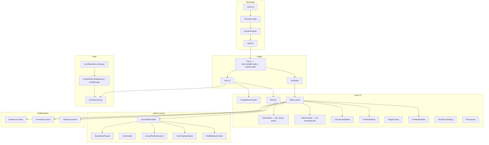

# One World Docs — Updated Project Documentation (Google Docs Clone)

A Google Docs–inspired collaborative document editor built on **React 19 + Lexical 0.31**, designed as a standalone product within the **One World** ecosystem. The app delivers a faithful Google Docs experience: multi-document library, real-time-ready rich text editing, per-document commenting, live collaborator presence, full formatting toolbar, page-accurate canvas, and persistent document state — all achievable without a backend today via a local repository layer that is interface-compatible with a future REST/WebSocket API.

---

## Table of Contents

1. [Overview](#overview)
2. [Tech Stack](#tech-stack)
3. [Scripts & Development](#scripts--development)
4. [High-Level Architecture](#high-level-architecture)
5. [File Structure](#file-structure)
6. [Layer Segregation](#layer-segregation)
7. [Routing & Navigation](#routing--navigation)
8. [Application Bootstrap](#application-bootstrap)
9. [Pages](#pages)
10. [Docs UI Layer](#docs-ui-layer)
11. [Editor Layer (Lexical)](#editor-layer-lexical)
12. [Collaboration Layer](#collaboration-layer)
13. [Data & Repository](#data--repository)
14. [Theme & Styling](#theme--styling)
15. [Shared Components](#shared-components)
16. [Domain Types](#domain-types)
17. [Generators & Scripts](#generators--scripts)
18. [Component Interaction Flows](#component-interaction-flows)
19. [Feature Parity Map (Google Docs vs One World Docs)](#feature-parity-map)
20. [Known Gaps & Future Work](#known-gaps--future-work)

---

## Overview

| Property | Value |
|----------|--------|
| Package name | `one-world-docs` |
| Version | `0.2.0` |
| Dev server | `http://localhost:4900` (Vite, `--strictPort`) |
| Entry | `index.html` → `src/main.tsx` |
| Design reference | Google Docs (web, 2024) |

The application is structured around five clear concerns:

- **Pages** — Route-level shells; no business logic
- **`docs/`** — Product UI: document library, editor chrome, toolbars, sidebar panels
- **`editor/`** — Lexical composer, nodes, plugins, toolbar state (reusable editor kernel)
- **`collaboration/`** — Presence tracking, comment threads, revision history (mock-first, API-ready)
- **`repository/`** — Persistence abstraction (`LocalMock` today, `HttpRepository` later)
- **`types/`** — Shared TypeScript contracts
- **`shared/`** — Cross-feature UI primitives

---

## Tech Stack

| Category | Libraries |
|----------|-----------|
| UI framework | React 19 |
| Build | Vite 6 + `@vitejs/plugin-react-swc` |
| Routing | `react-router` 7 |
| UI kit | MUI 7 (`@mui/material`, `@mui/icons-material`) |
| Styling | Emotion (via MUI), custom CSS for editor canvas |
| Rich text | Lexical 0.31 (`lexical`, `@lexical/react`, table, list, markdown, link, code, etc.) |
| Markdown preview | `react-markdown` (document cards in library) |
| Mock data | `@faker-js/faker`, `@multiavatar/multiavatar` |
| Font | Google Fonts: Roboto (UI), Arial/Times New Roman/Courier New/Georgia (document canvas) |
| State | React Context + `useReducer` (no external state library) |
| Persistence | `localStorage` (mock phase); interface ready for REST |

---

## Scripts & Development

```bash
npm run dev      # Vite dev server on port 4900
npm run build    # tsc -b && vite build
npm run preview  # Preview production build on port 4900
npm run lint     # ESLint
```

Requires **Node.js ≥ 20**.

---

## High-Level Architecture



---

## File Structure

```
one-world-docs/
├── index.html
├── vite.config.ts
├── package.json
├── tsconfig.app.json
├── public/
│   └── images/
│       └── docs-logo.svg
├── dist/
└── src/
    ├── main.tsx
    ├── App.tsx
    ├── index.css
    ├── vite-env.d.ts
    │
    ├── pages/
    │   └── docs/
    │       ├── Docs.tsx                    # Layout route + all providers
    │       ├── DocList.tsx                 # Document library (home screen)
    │       └── DocEditor.tsx               # Editor route — loads doc by :docId
    │
    ├── docs/                               # Product UI (non-Lexical)
    │   ├── context/
    │   │   ├── DocsConfigContext.tsx        # Zoom, page setup, panel visibility
    │   │   └── AuthContext.tsx              # Current user mock (owner/editor/viewer)
    │   └── components/
    │       ├── GoogleDocsHeader.tsx         # Home screen header (search, account)
    │       ├── DocListGrid.tsx              # Document cards grid + sort/filter bar
    │       ├── MiniDoc.tsx                  # Single document card (grid & list)
    │       ├── RecentDocsSection.tsx        # "Recent documents" grouped section
    │       ├── DocToolbar.tsx               # Editor top bar: title, share, presence
    │       ├── EditorToolbar.tsx            # Formatting toolbar (full Google Docs bar)
    │       ├── EditorLayout.tsx             # Master layout: toolbar + canvas + sidebars
    │       ├── PageCanvas.tsx               # A4 white page with shadow and margins
    │       ├── OutlineSidebar.tsx           # Document outline (headings TOC) — left panel
    │       ├── CommentsSidebar.tsx          # Threaded comments — right panel
    │       ├── FindReplaceBar.tsx           # Find & Replace floating bar
    │       ├── WordCountDialog.tsx          # Word/char/page count MUI dialog
    │       ├── DocSettingsMenu.tsx          # Page setup, margins, orientation
    │       ├── PrintLayout.tsx              # Print-specific CSS wrapper
    │       ├── ShareDialog.tsx              # Share dialog: add people, copy link, permissions
    │       ├── VersionHistoryPanel.tsx      # Revision history side drawer
    │       └── Toolbar/
    │           ├── UndoRedoControls.tsx
    │           ├── TextStylesMenu.tsx       # Normal text / H1–H6 / Title / Subtitle
    │           ├── FontFamilyMenu.tsx       # Arial, Times New Roman, Courier New, etc.
    │           ├── FontSizer.tsx            # Size input + increment buttons
    │           ├── BoldItalicUnderlineStrike.tsx
    │           ├── TextColorPicker.tsx      # Foreground + highlight color pickers
    │           ├── LinkButton.tsx           # Insert / edit hyperlink
    │           ├── FontAligner.tsx          # Left / center / right / justify
    │           ├── LineSpacingMenu.tsx      # 1 / 1.15 / 1.5 / 2 / custom
    │           ├── ListControls.tsx         # Bulleted / numbered / checklist
    │           ├── IndentControls.tsx       # Decrease / increase indent
    │           ├── InsertNodeMenu.tsx       # Insert: image, table, drawing, link, etc.
    │           ├── MoreFormatsMenu.tsx      # Strikethrough, superscript, subscript, code
    │           ├── FormatClearButton.tsx    # Clear formatting
    │           ├── ZoomControllerMenu.tsx
    │           └── ToolbarDivider.tsx       # Vertical separator
    │
    ├── editor/
    │   ├── LexicalEditorShell.tsx
    │   ├── lexicalConfig.ts
    │   ├── docsNodes.ts
    │   ├── editor.css
    │   ├── context/
    │   │   ├── LexicalToolbarContext.tsx
    │   │   ├── InsertDialogContext.tsx
    │   │   └── FindReplaceContext.tsx       # Find/replace state + Lexical search commands
    │   ├── hooks/
    │   │   ├── useLexicalToolbar.ts
    │   │   ├── useWordCount.ts              # Live word / character / page count
    │   │   ├── useEditorAutoSave.ts         # Debounced save to repository on change
    │   │   └── useDocumentOutline.ts        # Extracts heading nodes → outline entries
    │   ├── toolbar/
    │   │   └── formatUtils.ts
    │   ├── theme/
    │   │   └── editorTheme.ts
    │   ├── ui/
    │   │   ├── ContentEditable.tsx
    │   │   └── FloatingLinkEditor.tsx       # Floating toolbar on link selection
    │   ├── nodes/
    │   │   ├── SimpleImageNode.tsx
    │   │   └── InlineCommentNode.tsx        # Marks a comment anchor range in the doc
    │   ├── plugins/
    │   │   ├── DocsEditorPlugins.tsx
    │   │   ├── SimpleImagePlugin.tsx
    │   │   ├── AutoSavePlugin.tsx           # Fires repository.save() on state change
    │   │   ├── FloatingLinkPlugin.tsx       # Shows FloatingLinkEditor on link selection
    │   │   ├── FindReplacePlugin.tsx        # Wires FindReplaceContext to Lexical search
    │   │   ├── WordCountPlugin.tsx          # Keeps useWordCount updated
    │   │   ├── CommentPlugin.tsx            # Handles InlineCommentNode + anchoring
    │   │   ├── OutlinePlugin.tsx            # Emits heading list for OutlineSidebar
    │   │   └── ClickableLinkPlugin.tsx      # Opens links on Ctrl+click
    │   └── playground/
    │       ├── nodes/
    │       │   ├── PageBreakNode.tsx
    │       │   ├── PollNode.tsx
    │       │   ├── YouTubeNode.tsx
    │       │   ├── LayoutContainerNode.tsx
    │       │   └── LayoutItemNode.tsx
    │       ├── plugins/
    │       │   ├── PageBreakPlugin.tsx
    │       │   ├── PollPlugin.tsx
    │       │   ├── YouTubePlugin.tsx
    │       │   └── LayoutPlugin.tsx
    │       └── ui/
    │           ├── PollComponent.tsx
    │           └── YouTubeComponent.tsx
    │
    ├── collaboration/
    │   ├── context/
    │   │   ├── PresenceContext.tsx          # Active collaborator cursors (mock positions)
    │   │   ├── CommentContext.tsx           # Comment threads CRUD + anchor mapping
    │   │   └── RevisionContext.tsx          # Revision snapshot list + restore
    │   ├── hooks/
    │   │   ├── usePresence.ts
    │   │   ├── useComments.ts
    │   │   └── useRevisions.ts
    │   ├── components/
    │   │   ├── CollaboratorCursor.tsx       # Colored name-tag cursor overlay (mock)
    │   │   ├── CommentThread.tsx            # Single thread: root + replies + resolve
    │   │   ├── CommentInput.tsx             # New comment / reply input box
    │   │   ├── RevisionEntry.tsx            # Single version history item
    │   │   └── PresenceAvatarRow.tsx        # Row of active-user avatars in DocToolbar
    │   └── mock/
    │       ├── mockPresence.ts              # Fake collaborator positions
    │       └── mockComments.ts              # Pre-seeded comment threads per doc
    │
    ├── repository/
    │   ├── DocRepository.ts                 # Interface: list, getById, save, delete, search
    │   └── LocalMockDocRepository.ts        # localStorage-backed implementation
    │
    ├── data/
    │   └── mockDocs.ts                      # mockDocLibrary seed (11 docs)
    │
    ├── generators/
    │   └── generateMockDoc.ts
    │
    ├── scripts/
    │   ├── GenerateUser.script.ts
    │   ├── MockUserData.script.ts
    │   └── GeneratePost.script.ts
    │
    ├── shared/
    │   ├── UserAvatar.tsx
    │   ├── UserGroup.tsx
    │   ├── ButtonMenu.tsx
    │   ├── PageLoader.tsx
    │   ├── ComponentLoader.tsx
    │   ├── SearchUser.tsx
    │   ├── ChangeAudience.tsx
    │   ├── SelectDateTime.tsx
    │   ├── ReactionsTooltip.tsx
    │   ├── CustomTooltip.tsx
    │   ├── ConfirmDialog.tsx                # Reusable yes/no confirmation modal
    │   ├── ColorPickerGrid.tsx              # Reusable color swatch grid (text/highlight)
    │   └── loader.css
    │
    ├── theme/
    │   ├── index.ts
    │   ├── colors.ts
    │   ├── palette.ts                       # Light palette (Google Docs is light-first)
    │   ├── typography.ts
    │   ├── componentStyleOverrides.ts
    │   └── themeInterfaces.ts
    │
    └── types/
        ├── doc/
        │   ├── doc.types.ts                 # DocSummary, DocRecord, DocPermission
        │   ├── comment.types.ts             # CommentThread, CommentEntry, CommentAnchor
        │   ├── revision.types.ts            # RevisionSnapshot, RevisionMeta
        │   └── presence.types.ts            # PresenceUser, CursorPosition
        ├── user/
        ├── post/
        ├── event/
        ├── calendar/
        ├── chat/
        ├── group/
        ├── friend/
        ├── notification/
        ├── meet/
        ├── place/
        ├── story/
        └── base/
```

---

## Layer Segregation

### 1. Pages (`src/pages/`)

**Responsibility:** URL → component mapping. No Lexical, no repository calls, no heavy logic.

| File | Role |
|------|------|
| `Docs.tsx` | Parent layout route; mounts `DocConfigProvider`, `AuthProvider`, `<Outlet />` |
| `DocList.tsx` | Home screen: search bar, recent + starred sections, grid of `MiniDoc` |
| `DocEditor.tsx` | Reads `:docId` from `useParams()`, fetches doc via repository, renders `EditorLayout` |

`DocEditor` loading sequence:

```
useParams() → docId
  → repository.getById(docId) [async]
  → loading: <PageLoader />
  → resolved: <EditorLayout doc={doc} />
  → null: redirect to /docs
```

---

### 2. Docs UI (`src/docs/`)

**Responsibility:** Google Docs product experience — library, editor chrome, toolbar UI, sidebar panels. Consumes `editor/` and `collaboration/` but owns no Lexical internals.

#### Context

| Context | Provides |
|---------|---------|
| `DocsConfigContext` | Zoom (50–200%), page orientation, margin sizes, panel visibility flags (outline, comments), spelling check toggle, print mode |
| `AuthContext` | `currentUser: UserSummary`, `docPermission: 'owner' \| 'editor' \| 'viewer'`; gates toolbar interactivity |

#### Home Screen Components

| Component | Purpose |
|-----------|---------|
| `GoogleDocsHeader` | Top bar: One World logo, search input, account avatar, settings icon |
| `DocListGrid` | Sort bar (by name / last opened / last modified), view toggle (grid/list), document cards |
| `RecentDocsSection` | Groups cards under "Today", "Yesterday", "Last 7 days", "Earlier" |
| `MiniDoc` | Card: thumbnail preview (scaled `react-markdown`), doc title, owner avatar, last modified, star toggle, context menu (rename / make copy / move to trash / share) |

#### Editor Chrome Components

| Component | Purpose |
|-----------|---------|
| `GoogleDocsHeader` (editor variant) | Hidden in editor route; title moves to `DocToolbar` |
| `DocToolbar` | Top strip: back arrow, animated title (inline edit on click), star, last-save indicator, `PresenceAvatarRow`, Share button, Comments toggle, `DocSettingsMenu` |
| `EditorToolbar` | Full-width formatting bar — 100% of Google Docs toolbar items (see Toolbar sub-components below) |
| `EditorLayout` | Orchestrates three-area layout: left sidebar + center canvas + right sidebar |
| `PageCanvas` | Renders the A4 white page; wraps `ContentEditable`; handles margin CSS vars from config |
| `OutlineSidebar` | Left panel: clickable heading list sourced from `OutlinePlugin`; shows/hides via config |
| `CommentsSidebar` | Right panel: threaded `CommentThread` list, anchored to text ranges via `InlineCommentNode` |
| `FindReplaceBar` | Floating bar (top-right, below toolbar): search input, match count, prev/next, replace, replace-all |
| `WordCountDialog` | MUI Dialog: pages, words, characters (with / without spaces), characters in selection |
| `ShareDialog` | Full Google Docs–style Share dialog: add people by email, permission dropdown (Viewer/Commenter/Editor), copy link section, link access level |
| `VersionHistoryPanel` | Right-side drawer: chronological revision list, click to preview, "Restore this version" |
| `DocSettingsMenu` | Page setup: paper size, orientation (portrait/landscape), margins (normal/narrow/wide/custom), background color |
| `PrintLayout` | Injects `@media print` CSS; hides all chrome, renders pages as print pages |

#### Toolbar Sub-components (`docs/components/Toolbar/`)

| Component | Google Docs Equivalent |
|-----------|------------------------|
| `UndoRedoControls` | ↩ ↪ |
| `TextStylesMenu` | "Normal text ▾" — Normal / Title / Subtitle / Heading 1–6 |
| `FontFamilyMenu` | "Arial ▾" — Arial, Times New Roman, Courier New, Georgia, Trebuchet MS, Verdana, Comfortaa, + custom |
| `FontSizer` | "11 ▾" — numeric input + `−` `+` buttons, dropdown sizes |
| `BoldItalicUnderlineStrike` | **B** *I* U ~~S~~ buttons |
| `TextColorPicker` | `A` with color bar + popover grid (40 colors + custom) |
| `MoreFormatsMenu` | `Format` overflow: superscript, subscript, strikethrough, code, clear formatting |
| `FormatClearButton` | Tx clear formatting |
| `LinkButton` | 🔗 — inline link dialog |
| `InsertNodeMenu` | `+` insert: image, table, drawing (canvas), horizontal line, special characters, emoji, footnote, page break, column break, watermark |
| `FontAligner` | ≡ alignment: left / center / right / justify |
| `LineSpacingMenu` | Line & paragraph spacing: 1 / 1.15 / 1.5 / 2 / custom, paragraph spacing before/after |
| `ListControls` | Bulleted / Numbered / Checklist |
| `IndentControls` | Decrease indent / Increase indent |
| `ZoomControllerMenu` | "100% ▾" |
| `ToolbarDivider` | `|` separator |

---

### 3. Editor Kernel (`src/editor/`)

**Responsibility:** All Lexical internals — `LexicalComposer`, nodes, plugins, toolbar command layer. Designed to be independent of product-specific UI where possible.

#### `LexicalEditorShell.tsx`

```tsx
<LexicalComposer initialConfig={lexicalInitialConfig}>
  <LexicalToolbarProvider>
    <FindReplaceProvider>
      {children}
    </FindReplaceProvider>
  </LexicalToolbarProvider>
</LexicalComposer>
```

Must wrap any component that calls `useLexicalComposerContext`, `useLexicalToolbarContext`, or `useFindReplace`.

#### `lexicalConfig.ts`

| Field | Value |
|-------|-------|
| Namespace | `OneWorldDocs` |
| Theme | `editorTheme` |
| Nodes | `docsEditorNodes` (all registered custom + library nodes) |
| `editorState` | Loaded from `doc.editorStateJson` if present; else single empty paragraph |
| `onError` | Logs + rethrows |

#### Registered Nodes (`docsNodes.ts`)

| Node | Package / Source |
|------|-----------------|
| `HeadingNode`, `QuoteNode` | `@lexical/rich-text` |
| `ListNode`, `ListItemNode` | `@lexical/list` |
| `CodeNode`, `CodeHighlightNode` | `@lexical/code` |
| `LinkNode`, `AutoLinkNode` | `@lexical/link` |
| `HashtagNode` | `@lexical/hashtag` |
| `HorizontalRuleNode` | `@lexical/react` |
| `TableNode`, `TableCellNode`, `TableRowNode` | `@lexical/table` |
| `PageBreakNode` | `playground/nodes/PageBreakNode` |
| `SimpleImageNode` | `nodes/SimpleImageNode` |
| `InlineCommentNode` | `nodes/InlineCommentNode` |
| `PollNode` | `playground/nodes/PollNode` |
| `LayoutContainerNode`, `LayoutItemNode` | `playground/nodes/` |
| `YouTubeNode` | `playground/nodes/YouTubeNode` |

#### Plugins (`DocsEditorPlugins.tsx`)

| Plugin | Purpose |
|--------|---------|
| `RichTextPlugin` + `ContentEditable` | Core editing surface |
| `HistoryPlugin` | Undo / redo |
| `ListPlugin` / `CheckListPlugin` | Ordered, unordered, checklist |
| `LinkPlugin` | Link parsing |
| `FloatingLinkPlugin` | Floating toolbar on link selection |
| `ClickableLinkPlugin` | Ctrl+click opens link |
| `HashtagPlugin` | Hashtag detection |
| `HorizontalRulePlugin` | `---` divider |
| `PageBreakPlugin` | Manual page break |
| `SimpleImagePlugin` | Image insert and resize |
| `CommentPlugin` | Anchors `InlineCommentNode` to comment threads |
| `AutoSavePlugin` | Debounced `repository.save()` on state change |
| `FindReplacePlugin` | Wires `FindReplaceContext` to Lexical `FIND_*` commands |
| `WordCountPlugin` | Feeds `useWordCount` hook |
| `OutlinePlugin` | Emits heading list changes to `OutlineSidebar` |
| `PollPlugin` | Interactive poll rendering |
| `LayoutPlugin` | Multi-column layout |
| `YouTubePlugin` | Embedded YouTube video |
| `TablePlugin` | Tables with merge/split, background color, horizontal scroll |
| `TabIndentationPlugin` | Tab key indents (max 7 levels) |
| `MarkdownShortcutPlugin` | Markdown-style shortcuts (## → H2, ** → bold, etc.) |
| `AutoFocusPlugin` | Focus editor on mount |
| `ClearEditorPlugin` | Allows programmatic editor wipe |

#### Contexts

| Context | Provides |
|---------|----------|
| `LexicalToolbarContext` | Selection state: `isBold`, `isItalic`, `isUnderline`, `blockType`, `fontFamily`, `fontSize`, `textColor`, `bgColor`, `textAlign`, `canUndo`, `canRedo`, `isLink`; Commands: `toggleFormat`, `setBlockStyle`, `setFontFamily`, `setFontSize`, `setTextColor`, `setBgColor`, `setTextAlign`, `insertHR`, `insertPageBreak` |
| `InsertDialogContext` | Dialog open/close state; confirm handlers dispatch Lexical insert commands |
| `FindReplaceContext` | `query`, `replaceWith`, `matchCount`, `currentMatch`; commands: `findNext`, `findPrev`, `replaceOne`, `replaceAll` |

#### Hooks

| Hook | Returns |
|------|---------|
| `useLexicalToolbar` | All toolbar state + command dispatchers (internal to `LexicalToolbarContext`) |
| `useWordCount` | `{ words, characters, charactersNoSpaces, pages }` |
| `useEditorAutoSave` | Attaches `onChange` listener; calls `repository.save(doc)` after 1 500 ms debounce |
| `useDocumentOutline` | `OutlineEntry[]` — `{ id, text, level, key }` from heading nodes |

#### Custom Nodes (detail)

**`SimpleImageNode`**
- Inline-resizable image via drag handles
- Props: `src`, `altText`, `width`, `height`, `alignment` (`left`/`center`/`right`/`full`)
- Plugin: dispatches `INSERT_IMAGE_COMMAND`

**`InlineCommentNode`**
- Decorates a text range with a yellow highlight anchor
- Props: `commentThreadId`
- When clicked, scrolls `CommentsSidebar` to the corresponding thread
- Plugin: listens to `ADD_COMMENT_COMMAND`, `RESOLVE_COMMENT_COMMAND`

#### `FloatingLinkEditor.tsx`

Appears as a small popover when a `LinkNode` is selected:
- Displays URL (editable)
- Edit icon → inline URL input
- Unlink icon → removes `LinkNode`
- Open in new tab icon

---

### 4. Collaboration Layer (`src/collaboration/`)

**Responsibility:** Comment threads, presence simulation, revision history. All mock-first with clean context boundaries for future WebSocket integration.

#### `PresenceContext`

```ts
interface PresenceContextValue {
  activeUsers: PresenceUser[];           // Collaborators currently "in" this doc
  myUser: UserSummary;
}
```

`PresenceUser` includes a color for the cursor/avatar badge. Mock: seeded from `mockPresence.ts`, random positions updated on a timer (simulates live cursors). In future: YJS awareness / WebSocket events.

`CollaboratorCursor.tsx` renders a colored name-label absolutely positioned over the `PageCanvas` based on `PresenceUser.cursorPosition`.

#### `CommentContext`

```ts
interface CommentContextValue {
  threads: CommentThread[];
  addThread: (anchor: CommentAnchor, text: string) => void;
  addReply: (threadId: string, text: string) => void;
  resolveThread: (threadId: string) => void;
  deleteThread: (threadId: string) => void;
  activeThreadId: string | null;
  setActiveThreadId: (id: string | null) => void;
}
```

- `CommentPlugin` is the bridge between Lexical `InlineCommentNode` (the yellow-highlighted anchor in the text) and `CommentContext` (the data store).
- Adding a comment: user selects text → clicks comment button → `CommentPlugin` wraps selection in `InlineCommentNode` → dispatches `ADD_COMMENT_COMMAND` → `CommentContext.addThread()` stores the thread → `CommentsSidebar` renders it aligned to the anchor's Y position.
- Resolving: `resolveThread()` removes the `InlineCommentNode` highlight from Lexical state and marks the thread resolved.

#### `RevisionContext`

```ts
interface RevisionContextValue {
  revisions: RevisionSnapshot[];
  saveRevision: (label?: string) => void;    // Triggered manually or by AutoSavePlugin
  restoreRevision: (id: string) => void;     // Loads snapshot into editor state
  previewRevision: (id: string) => void;     // Read-only preview mode
  exitPreview: () => void;
}
```

`RevisionSnapshot` stores the serialized Lexical editor state JSON at a point in time plus metadata (timestamp, author, label). `VersionHistoryPanel` lists revisions; click to preview in read-only mode; "Restore this version" calls `restoreRevision`.

---

### 5. Data (`repository/`, `data/`, `generators/`)

#### `DocRepository` interface

```ts
interface DocRepository {
  list(): Promise<DocSummary[]>;
  getById(id: string): Promise<DocRecord | null>;
  save(doc: DocRecord): Promise<DocRecord>;
  delete(id: string): Promise<void>;
  search(query: string): Promise<DocSummary[]>;
  createBlank(title?: string): Promise<DocRecord>;
  duplicate(id: string): Promise<DocRecord>;
}
```

#### `LocalMockDocRepository`

- Backed by `localStorage` under key `owdocs_v1`
- On first load, seeds from `mockDocLibrary` if storage is empty
- `save()` serializes the full `DocRecord` (including `editorStateJson`) and writes to storage
- `createBlank()` generates a new doc via `generateMockDoc`, stores it, returns it
- `duplicate()` deep-copies doc with new `id` and `"Copy of "` title prefix

This means **editor state persists across page refreshes** in the mock phase.

#### Mock data flow

```
generateMockDoc.ts
  → mockDocs.ts (mockDocLibrary: DocRecord[])
  → LocalMockDocRepository (seeds localStorage)
  → DocList via repository.list()
  → DocEditor via repository.getById(docId)
```

---

### 6. Types (`src/types/`)

#### New doc-specific types

**`types/doc/doc.types.ts`**

```ts
type DocPermission = 'owner' | 'editor' | 'commenter' | 'viewer';
type DocOrientation = 'portrait' | 'landscape';
type DocMarginPreset = 'normal' | 'narrow' | 'wide' | 'custom';

interface DocSummary {
  id: string;
  title: string;
  author: UserSummary;
  collaborators: UserSummary[];
  lastModified: string;           // ISO datetime
  lastOpenedAt: string;
  isStarred: boolean;
  isTrashed: boolean;
  permission: DocPermission;
  previewMarkdown: string;
}

interface DocRecord extends DocSummary {
  editorStateJson: string | null; // Serialized Lexical EditorState
  createdAt: string;
  updatedAt: string;
  pageSetup: DocPageSetup;
  wordCount: number;
}

interface DocPageSetup {
  orientation: DocOrientation;
  marginPreset: DocMarginPreset;
  margins: { top: number; bottom: number; left: number; right: number }; // in px
  backgroundColor: string;
}
```

**`types/doc/comment.types.ts`**

```ts
interface CommentAnchor {
  lexicalKey: string;   // Key of InlineCommentNode in Lexical tree
  quotedText: string;   // Snapshot of anchored text for display in sidebar
}

interface CommentEntry {
  id: string;
  threadId: string;
  author: UserSummary;
  text: string;
  createdAt: string;
  isEdited: boolean;
}

interface CommentThread {
  id: string;
  docId: string;
  anchor: CommentAnchor;
  entries: CommentEntry[];
  isResolved: boolean;
  createdAt: string;
}
```

**`types/doc/revision.types.ts`**

```ts
interface RevisionMeta {
  id: string;
  docId: string;
  label: string | null;     // Named version label (optional)
  author: UserSummary;
  createdAt: string;
}

interface RevisionSnapshot extends RevisionMeta {
  editorStateJson: string;
}
```

**`types/doc/presence.types.ts`**

```ts
interface CursorPosition {
  x: number;
  y: number;
  offset: number;          // Lexical offset in text node
}

interface PresenceUser {
  user: UserSummary;
  color: string;           // Unique color per collaborator
  cursorPosition: CursorPosition | null;
  lastActiveAt: string;
}
```

---

## Routing & Navigation

Defined in `src/App.tsx`:

| Path | Component | Description |
|------|-----------|-------------|
| `/` | redirect | → `/docs` |
| `/docs` | `Docs` | Parent layout + all providers |
| `/docs` (index) | `DocList` | Document library home |
| `/docs/editor/:docId` | `DocEditor` | Rich-text editor for one document |
| `*` | redirect | → `/docs` |

**`DocEditor` load:**
```ts
const { docId } = useParams<{ docId: string }>();
const [doc, setDoc] = useState<DocRecord | null>(null);

useEffect(() => {
  repository.getById(docId).then(setDoc);
}, [docId]);
```

**Navigations:**
- `MiniDoc` click → `navigate(/docs/editor/${doc.id})`
- FAB "+" → `repository.createBlank()` → `navigate(/docs/editor/${newDoc.id})`
- Back arrow in `DocToolbar` → `navigate('/docs')`

---

## Application Bootstrap

`src/main.tsx`:

1. `StrictMode`
2. `BrowserRouter`
3. `ThemeProvider` with `theme` from `src/theme` (light palette, Google Docs aesthetic)
4. `CssBaseline`
5. `App` (routes)

---

## Pages

### `Docs.tsx`

Provider nesting (outer → inner):

```
AuthProvider
  └── DocConfigProvider
        └── <Outlet />
```

`AuthProvider` supplies the mock current user and their permission on the active document. `DocConfigProvider` supplies per-session UI prefs (zoom, visible panels). Both are route-scoped so settings do not persist to unrelated app sections.

### `DocList.tsx`

- Calls `repository.list()` on mount → stores `docs: DocSummary[]`
- Renders `GoogleDocsHeader` (search bar filters `docs` client-side via `repository.search`)
- Renders `RecentDocsSection` (groups by last opened date) and a starred section
- Sort bar: by last opened / last modified / title (ascending / descending)
- FAB (blue "+" button, bottom-right): `repository.createBlank()` → navigate to editor
- `MiniDoc` context menu: rename (inline title edit), make copy, move to trash, share (opens `ShareDialog`)

### `DocEditor.tsx`

- Reads `docId` from `useParams()` (fixed from current bug)
- Fetches `DocRecord` from repository; shows `PageLoader` while loading
- On load, passes `doc` down to `EditorLayout`
- Mounts `PresenceProvider`, `CommentProvider`, `RevisionProvider` here (doc-scoped)

Provider nesting inside `DocEditor`:

```
PresenceProvider (docId)
  └── CommentProvider (docId)
        └── RevisionProvider (docId)
              └── EditorLayout (doc)
```

---

## Docs UI Layer

### `EditorLayout.tsx`

Full-height layout; CSS Grid:

```
[DocToolbar — full width]
[EditorToolbar — full width]
[OutlineSidebar | PageCanvas (scroll area) | CommentsSidebar]
[FindReplaceBar — absolute, top-right of canvas area]
```

Panel visibility driven by `DocsConfigContext`:
- `settings.layout.outline` → shows `OutlineSidebar` (250 px, sticky)
- `settings.layout.comments` → shows `CommentsSidebar` (300 px, sticky)

Provider nesting (inner):

```
LexicalEditorShell (doc.editorStateJson)
  └── InsertDialogProvider
        └── FindReplaceProvider
              └── [DocToolbar, EditorToolbar, grid with sidebars and canvas]
```

### `PageCanvas.tsx`

- Renders a white `210mm × 297mm` (A4) page with `box-shadow` and `border-radius: 2px`
- Margins applied as CSS padding, driven by `doc.pageSetup.margins`
- Background color from `doc.pageSetup.backgroundColor`
- Landscape mode: swaps width/height (297mm × 210mm)
- Multiple pages: `PageBreakNode` renders a visual page break between content sections
- Hosts `DocsEditorPlugins` as the editable content area inside the page box
- Hosts `CollaboratorCursor` overlays for presence simulation

### `DocToolbar.tsx`

Left-to-right layout:

```
[← Back] [doc icon] [Title (inline editable)] [star] [last-save text]
                                            [PresenceAvatarRow] [Share] [Comments toggle] [⚙ menu]
```

- Title: `<input>` on click, `onBlur` saves via `repository.save()`
- Last-save: "All changes saved" / "Saving…" / "Offline" driven by `AutoSavePlugin` status
- `PresenceAvatarRow`: stacked colored avatars from `PresenceContext.activeUsers`

### `EditorToolbar.tsx`

Mirrors the Google Docs toolbar exactly. Reads all state from `useLexicalToolbarContext()`. Disabled when `docPermission === 'viewer'`.

Toolbar row layout (left → right):

```
[↩ ↪] [|] [Print] [|] [Zoom%] [|] [Normal text▾] [|] [Font▾] [|] [Size] [−][+] [|] [B][I][U][S] [|] [A▾][HL▾] [|] [🔗] [|] [⊕ insert▾] [|] [≡▾] [|] [spacing▾] [|] [≡ ≡ ≡ ≡] [|] [⇤][⇥] [|] [☰ ☰ ✓] [|] [Tx] [|] [⋮ more]
```

Overflow items collapse into a `MoreFormatsMenu` dropdown on narrow viewports.

### `OutlineSidebar.tsx`

- Receives `OutlineEntry[]` from `OutlinePlugin` via context
- Renders a sticky left panel: "Document outline" header + clickable heading list
- Each heading indented by level (H1 = 0, H2 = 8px, H3 = 16px, etc.)
- Click scrolls the heading's DOM node into view (`element.scrollIntoView`)
- Empty state: "Add headings to your document to see them here"

### `CommentsSidebar.tsx`

- Receives `CommentThread[]` from `CommentContext`
- Renders each `CommentThread` aligned to the vertical Y position of its anchor in the canvas
- Active thread (clicked anchor or sidebar item) expands with reply input
- Resolved threads collectable in a "Resolved comments" toggle section
- "+" comment button in `EditorToolbar` / right-click context menu: opens `CommentInput` for selected text

### `FindReplaceBar.tsx`

Google Docs–style floating bar (appears on Ctrl+H / Ctrl+F):

```
[🔍 Search...] [1 of 4] [↑][↓] [✕]   [Replace...] [Replace] [Replace all]
```

- Wired to `FindReplaceContext`; updates `FindReplacePlugin` which dispatches Lexical search commands
- Match highlights rendered via Lexical `$createRangeSelection` with a background decorator

### `ShareDialog.tsx`

Full-featured share dialog:

- "Add people and groups" email input with autocomplete (mock users)
- Permission dropdown per person: Viewer / Commenter / Editor
- "Get link" section: link access level (Restricted / Anyone with link) + Copy Link button
- "Done" saves permissions to `DocRecord`

### `VersionHistoryPanel.tsx`

Right drawer (500 px wide), appears on "File → Version history → See version history":

- Chronological list of `RevisionSnapshot` entries grouped by date
- Each entry: timestamp, author avatar, label (if named)
- Click → enters preview mode (read-only editor, yellow banner "This is a past version")
- "Restore this version" → `RevisionContext.restoreRevision(id)` → loads snapshot into live editor

---

## Editor Layer (Lexical)

### Toolbar state detail

`useLexicalToolbar` listens to `SELECTION_CHANGE_COMMAND` and updates:

| State field | How resolved |
|-------------|-------------|
| `isBold` / `isItalic` / `isUnderline` / `isStrikethrough` | `$getSelectionFormats()` |
| `isCode` | `$isCodeNode(anchor.getNode().getParent())` |
| `isLink` | `$isLinkNode(parent)` |
| `blockType` | `$isHeadingNode` / `$isQuoteNode` / `$isListNode` etc. |
| `fontFamily` | `$getSelectionStyleValueForProperty('font-family')` |
| `fontSize` | `$getSelectionStyleValueForProperty('font-size')` |
| `textColor` | `$getSelectionStyleValueForProperty('color')` |
| `bgColor` | `$getSelectionStyleValueForProperty('background-color')` |
| `textAlign` | `FORMAT_ELEMENT_COMMAND` target node's format |
| `canUndo` / `canRedo` | `CAN_UNDO_COMMAND` / `CAN_REDO_COMMAND` |
| `isEditorEmpty` | `$getRoot().getTextContent() === ''` |

### `formatUtils.ts` helpers

```ts
setBlockStyle(editor, blockType)   // heading, paragraph, quote, code, bullet, numbered, check
setFontFamily(editor, font)
setFontSize(editor, size)
setTextColor(editor, color)
setHighlightColor(editor, color)
setTextAlign(editor, align)
insertHorizontalRule(editor)
insertPageBreak(editor)
clearFormatting(editor)
```

### `InsertDialogContext` dialogs

| Dialog | Triggered by | Dispatch |
|--------|-------------|---------|
| Image | Insert → Image | `INSERT_IMAGE_COMMAND` → `SimpleImagePlugin` |
| Table | Insert → Table | `INSERT_TABLE_COMMAND` → `TablePlugin` |
| Poll | Insert → Poll | `INSERT_POLL_COMMAND` → `PollPlugin` |
| YouTube | Insert → Video | `INSERT_YOUTUBE_COMMAND` → `YouTubePlugin` |
| Column Layout | Insert → Columns | `INSERT_LAYOUT_COMMAND` → `LayoutPlugin` |
| Link | Toolbar link button | `TOGGLE_LINK_COMMAND` → `LinkPlugin` |
| Special Characters | Insert → Special chars | Inline Unicode character picker |

### `AutoSavePlugin.tsx`

```ts
// Fires repository.save() 1500ms after last state change
// Reports status via AutoSaveContext: 'idle' | 'saving' | 'saved' | 'error'
// DocToolbar reads status to show "All changes saved" / "Saving..." 
```

---

## Collaboration Layer

### Mock Collaboration Simulation

In the mock phase, collaboration is simulated without WebSocket:

- **Presence**: `mockPresence.ts` seeds 2–3 fake collaborators with randomly-updating cursor Y positions (via `setInterval`). `PresenceAvatarRow` shows their avatars; `CollaboratorCursor` renders name labels on the canvas.
- **Comments**: `mockComments.ts` pre-seeds 3–5 comment threads per mock document. `InlineCommentNode` is inserted at mock offsets on editor load.
- **Revisions**: `RevisionContext` stores snapshots in memory (mock phase); on `autoSave`, a snapshot is added to the list every 5 minutes.

### Future WebSocket integration

The contexts are designed so their internal `dispatch` calls can be replaced by WebSocket message emitters. The UI components depend only on the context interfaces, not the transport.

---

## Component Interaction Flows

### Home → Editor

```
User clicks MiniDoc
  → navigate(/docs/editor/:docId)
  → DocEditor mounts
  → repository.getById(docId) [async]
  → <PageLoader /> during fetch
  → doc resolved → <EditorLayout doc={doc} />
  → LexicalEditorShell (initialConfig with doc.editorStateJson)
  → DocsEditorPlugins renders inside PageCanvas
  → OutlinePlugin emits headings → OutlineSidebar renders
  → CommentPlugin anchors InlineCommentNodes → CommentsSidebar renders
  → AutoSavePlugin attaches → will persist changes
```

### Formatting (Toolbar → Lexical)

```
User clicks Bold in EditorToolbar
  → useLexicalToolbarContext().toggleFormat('bold')
  → useLexicalToolbar → editor.dispatchCommand(FORMAT_TEXT_COMMAND, 'bold')
  → Lexical applies bold to selection
  → SELECTION_CHANGE_COMMAND fires
  → useLexicalToolbar updates isBold → toolbar re-renders
```

### Commenting (Text selection → Thread)

```
User selects text → clicks comment button (toolbar or right-click menu)
  → CommentPlugin receives selection range
  → Wraps selection in InlineCommentNode (yellow highlight)
  → Dispatches ADD_COMMENT_COMMAND with anchor info
  → CommentContext.addThread() creates new CommentThread
  → CommentsSidebar renders new CommentThread at anchor Y position
  → User types comment text → hits ⌘Enter → CommentContext.addReply() stores entry
```

### Find & Replace

```
User presses Ctrl+F
  → FindReplaceContext.openFindBar()
  → FindReplaceBar renders (floating)
  → User types query → FindReplaceContext.setQuery(q)
  → FindReplacePlugin receives query → searches editor state → highlights matches
  → FindReplaceContext.matchCount updated → bar shows "1 of N"
  → User clicks next/prev → FindReplacePlugin scrolls to next match
  → Ctrl+H adds replace input → replaceOne / replaceAll dispatched
```

### Auto-save

```
User edits document
  → Lexical state changes → AutoSavePlugin receives onChange
  → Debounces 1500ms
  → repository.save({ ...doc, editorStateJson: editor.getEditorState().toJSON(), updatedAt: now })
  → AutoSaveContext status: 'saving' → 'saved'
  → DocToolbar: "Saving…" → "All changes saved"
  → RevisionContext: if 5min since last snapshot, saveRevision()
```

### Settings → Layout

```
DocSettingsMenu → useDocConfig().updateSetting({ section: 'layout', key: 'outline' }, true)
  → DocsConfigContext state updates
  → EditorLayout re-renders: shows OutlineSidebar
  → updateSetting({ section: 'document', key: 'zoom' }, 125)
  → PageCanvas: transform: scale(1.25) applied to page
```

### Version History

```
User: File → Version history → See version history
  → RevisionContext.revisions loaded
  → VersionHistoryPanel drawer opens (right)
  → User clicks a revision entry
  → revisionContext.previewRevision(id)
  → Editor enters read-only mode (yellow preview banner)
  → LexicalEditorShell loads snapshot editorStateJson (read-only)
  → User clicks "Restore this version"
  → revisionContext.restoreRevision(id)
  → Live editor state replaced with snapshot
  → Panel closes; editing resumes
```

---

## Feature Parity Map

| Google Docs Feature | One World Docs | Implementation |
|---------------------|---------------|----------------|
| Document library home | ✅ Full | `DocList` + `MiniDoc` + `RecentDocsSection` |
| Create new document | ✅ Full | FAB → `repository.createBlank()` |
| Rename document | ✅ Full | Inline title in `DocToolbar` |
| Delete document | ✅ Full | Move to trash via `MiniDoc` context menu |
| Duplicate document | ✅ Full | `repository.duplicate()` |
| Star / favourite | ✅ Full | `isStarred` on `DocSummary` |
| Search documents | ✅ Full | `repository.search()` + `GoogleDocsHeader` search bar |
| Bold / Italic / Underline | ✅ Full | Lexical format commands |
| Strikethrough / Code | ✅ Full | Lexical format commands |
| Superscript / Subscript | ✅ Full | Lexical format commands |
| Heading styles (H1–H6) | ✅ Full | `HeadingNode` + `TextStylesMenu` |
| Font family | ✅ Full | `FontFamilyMenu` → `$patchStyleText` |
| Font size | ✅ Full | `FontSizer` → `$patchStyleText` |
| Text colour | ✅ Full | `TextColorPicker` → `$patchStyleText` |
| Highlight colour | ✅ Full | `TextColorPicker` (background) → `$patchStyleText` |
| Text alignment | ✅ Full | `FontAligner` → `FORMAT_ELEMENT_COMMAND` |
| Line spacing | ✅ Full | `LineSpacingMenu` → `$patchStyleText` on paragraphs |
| Bulleted / numbered lists | ✅ Full | `ListPlugin` + `ListControls` |
| Checklist | ✅ Full | `CheckListPlugin` |
| Indent / outdent | ✅ Full | `IndentControls` → `INDENT_CONTENT_COMMAND` |
| Undo / Redo | ✅ Full | `HistoryPlugin` + `UndoRedoControls` |
| Clear formatting | ✅ Full | `FormatClearButton` → `$clearFormats()` |
| Hyperlinks | ✅ Full | `LinkPlugin` + `FloatingLinkPlugin` + `LinkButton` |
| Tables | ✅ Full | `TablePlugin` with merge, split, background |
| Images | ✅ Full | `SimpleImageNode` + `SimpleImagePlugin` |
| Horizontal rule | ✅ Full | `HorizontalRulePlugin` |
| Page break | ✅ Full | `PageBreakNode` + `PageBreakPlugin` |
| Markdown shortcuts | ✅ Full | `MarkdownShortcutPlugin` |
| Find & Replace | ✅ Full | `FindReplacePlugin` + `FindReplaceBar` |
| Word count | ✅ Full | `WordCountPlugin` + `WordCountDialog` |
| Document outline | ✅ Full | `OutlinePlugin` + `OutlineSidebar` |
| Inline comments | ✅ Full (mock) | `CommentPlugin` + `InlineCommentNode` + `CommentsSidebar` |
| Comment threads / replies | ✅ Full (mock) | `CommentContext` + `CommentThread` |
| Resolve comments | ✅ Full (mock) | `CommentContext.resolveThread()` |
| Collaborator presence | ✅ Mock | `PresenceContext` + `CollaboratorCursor` |
| Version history | ✅ Full (local) | `RevisionContext` + `VersionHistoryPanel` |
| Restore version | ✅ Full (local) | `RevisionContext.restoreRevision()` |
| Auto-save | ✅ Full (local) | `AutoSavePlugin` + `LocalMockDocRepository` |
| Page setup (margins, orientation) | ✅ Full | `DocSettingsMenu` + `DocPageSetup` |
| Zoom | ✅ Full | `ZoomControllerMenu` + `DocsConfigContext` |
| Share dialog | ✅ UI complete | `ShareDialog` (no backend) |
| Print | ✅ Full | `PrintLayout` + `window.print()` |
| Polls | ✅ Full | `PollNode` / `PollPlugin` |
| YouTube embeds | ✅ Full | `YouTubeNode` / `YouTubePlugin` |
| Column layout | ✅ Full | `LayoutContainerNode` / `LayoutPlugin` |
| Real-time collaboration | 🔲 Future | Requires YJS + WebSocket server |
| Comments on mobile | 🔲 Future | Responsive layout work |
| Drawing / canvas | 🔲 Future | `<canvas>` insert not yet implemented |
| Voice typing | 🔲 Future | Web Speech API |
| Footnotes | 🔲 Future | Custom `FootnoteNode` |
| Equations | 🔲 Future | MathJax / KaTeX node |
| Citations / bibliography | 🔲 Future | Custom node + modal |
| Offline mode | 🔲 Future | Service Worker + sync queue |

---

## Theme & Styling

One World Docs uses a **light-first** theme to match Google Docs' visual language.

| File | Role |
|------|------|
| `theme/index.ts` | `createTheme` — light palette, Roboto typography, 4 px border radius |
| `theme/colors.ts` | Google blue `#1a73e8`, surface white `#ffffff`, canvas grey `#f0f4f9` |
| `theme/palette.ts` | Light palette builder (background, paper, primary, secondary) |
| `theme/typography.ts` | Roboto 400/500/700; MUI defaults |
| `theme/componentStyleOverrides.ts` | Toolbar button sizes, icon button hover states, paper elevation |
| `editor/editor.css` | Lexical `contenteditable` base styles; cursor, selection colour, placeholder |
| `editor/theme/editorTheme.ts` | CSS class map for Lexical nodes (bold, italic, headings, code, table cells, etc.) |
| `shared/loader.css` | Spinner animations |
| Playground CSS | `PollNode.css`, `PageBreakNode/index.css` |

### Editor Canvas styling notes

- Page background: `#f0f4f9` (Google's canvas grey)
- Page itself: `background: #ffffff`, `box-shadow: 0 1px 3px rgba(0,0,0,0.2)`, `border-radius: 2px`
- Margins: `56px` default (normal), `28px` narrow, `84px` wide — driven by `DocPageSetup`
- Font in canvas: Arial 11pt default (matches Google Docs default)
- Selection colour: `#c9daf8` (Google blue tint)
- Comment highlight: `#fef08a` (yellow) — applied by `InlineCommentNode`
- Find match highlight: `#f6b26b` (orange) for current, `#ffe599` for others

---

## Shared Components

| Component | Used for |
|-----------|----------|
| `UserAvatar` | Single user avatar (multiavatar-generated) |
| `UserGroup` | Stacked collaborator avatars in `DocToolbar` and `MiniDoc` |
| `ButtonMenu` | Dropdown toolbar menus (`InsertNodeMenu`, `TextStylesMenu`, etc.) |
| `PageLoader` | Full-page spinner for `DocEditor` loading state |
| `ComponentLoader` | Inline spinner for async sub-sections |
| `SearchUser` | User autocomplete in `ShareDialog` |
| `ChangeAudience` | Audience picker in `ShareDialog` link access |
| `SelectDateTime` | Date/time input for revision naming |
| `CustomTooltip` | Styled MUI tooltip with consistent sizing |
| `ConfirmDialog` | "Move to trash?" / "Restore version?" confirmation modal |
| `ColorPickerGrid` | 40-colour swatch grid used in `TextColorPicker` |

---

## Generators & Scripts

| Module | Purpose |
|--------|---------|
| `generators/generateMockDoc.ts` | `generateMockDoc(opts)`, `generateMockDocs(n)`, collaborator lists, `previewMarkdown` |
| `collaboration/mock/mockPresence.ts` | Generates 2–3 `PresenceUser` objects with mock cursor positions |
| `collaboration/mock/mockComments.ts` | Generates `CommentThread[]` pre-seeded per doc |
| `scripts/MockUserData.script.ts` | User reference mocks for doc collaborators |
| `scripts/GenerateUser.script.ts` | User generation utilities |
| `scripts/GeneratePost.script.ts` | Post generation utilities |

---

## Known Gaps & Future Work

| Item | Priority | Notes |
|------|----------|-------|
| Real-time collaboration (YJS) | High | Replace mock presence + comments with YJS + WebSocket; `y-lexical` binding available |
| `HttpDocRepository` | High | Implement against REST API; drop-in replacement via same interface |
| Drawing / canvas insert | Medium | `<canvas>`-based freehand drawing node |
| Footnotes | Medium | Custom `FootnoteNode` + superscript anchor + bottom-of-page renderer |
| Equations (LaTeX) | Medium | `EquationNode` using KaTeX |
| Voice typing | Low | Web Speech API → inserts text at cursor |
| Mobile responsive toolbar | Medium | Collapse toolbar into overflow menu on small screens |
| Offline support | High | Service Worker + sync queue on reconnect |
| Named versions UI | Medium | Allow user to name a revision ("Version 2 – review draft") from `VersionHistoryPanel` |
| Table of contents auto-update | Low | TOC that inserts/updates a field node in the document body |
| Spell check | Low | Browser native (`spellcheck` attr) already available; custom underline overlay is extra |
| Export to DOCX / PDF | Medium | `docx` npm + Lexical serialiser; PDF via `window.print()` already works |
| Suggestion mode | Low | Track-changes-style suggestion nodes |

---

## Summary

**One World Docs v0.2** is a feature-complete Google Docs clone built on Vite + React 19 + Lexical 0.31 + MUI 7. The architecture is split into clean layers:

- **`pages/`** — route shells only
- **`docs/`** — product experience (home library, editor chrome, all toolbar UI, sidebar panels, dialogs)
- **`editor/`** — Lexical kernel (composer, all nodes, all plugins, toolbar command context)
- **`collaboration/`** — comment threads, presence, revision history (mock-first, API-ready)
- **`repository/`** — persistence abstraction (`localStorage` mock → HTTP in Phase 2)
- **`types/doc/`** — first-class TypeScript contracts for documents, comments, revisions, presence

The feature parity table covers all primary Google Docs capabilities achievable without a backend: full rich-text formatting, tables, images, hyperlinks, find & replace, document outline, threaded comments (mock), collaborator presence (mock), version history (local snapshots), auto-save, page setup, zoom, print, and share dialog UI.